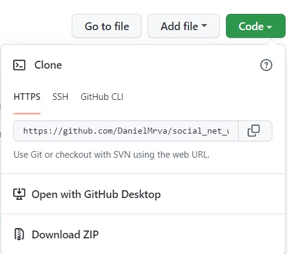
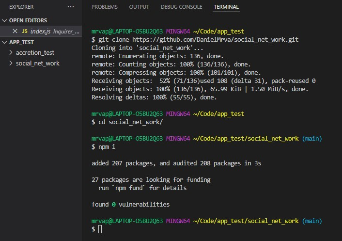
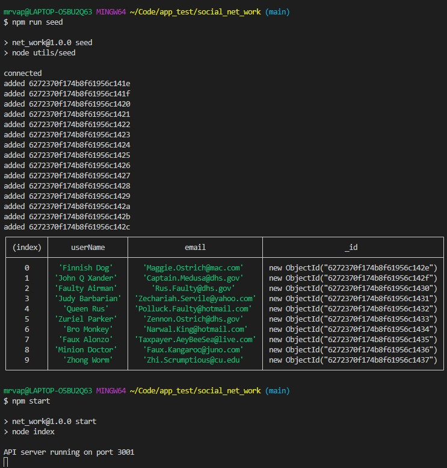
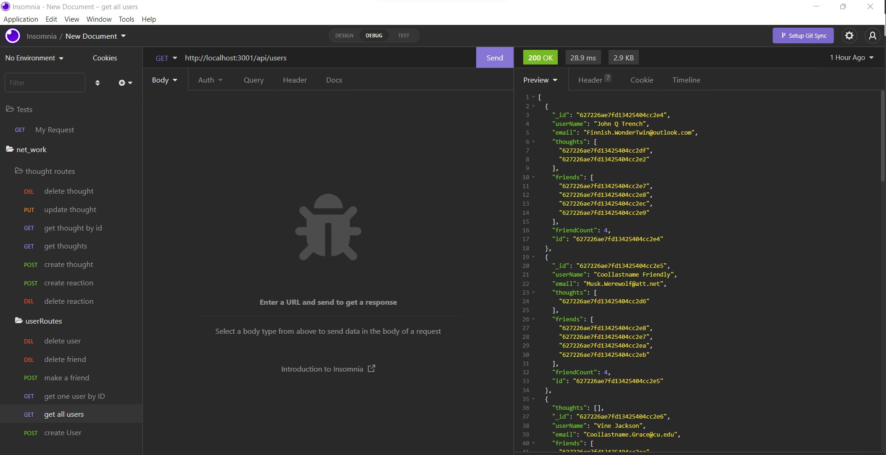

# [social_net_work](https://github.com/DanielMrva/social_net_work) [](https://opensource.org/licenses/MIT)
  
  ## Description
  A very cleverly named, yet basic social network API built using Express, MongoDB, Mongoose, and utilizing lorum-ipsum module for seed text generation.  Functionality includes the ability to perform all CRUD operations on Users, Thoughts, and Reactions.  A friends-list functionality is also included.

  ## Table of Conents
   1. [Installation](#installation)
   1. [Usage](#usage)
   1. [Contribution](#contribution)
   1. [Questions](#questions)
   1. [Github Repository](#github-repository)
   1. [License](#license)
  
  ## Installation

  Note: This installation assumes you have MongoDB installed and are mildly familiar with it.  Please refer to the [mongoDB](https://www.mongodb.com/) and [Mongoose](https://mongoosejs.com/docs/) docs.

  Open github link, click on "Code" button, and copy repo link.

  In Bash navigate to desired parent directory and type "git clone" then paste the repo link.

  Open project in Node terminal or code editor terminal and run "npm intall" to install dependencies.


  

  
  
  ## Usage 
  After installation of dependencies, you can run the server by running:

  ```
  npm start
  ```

  However, the app also includes a seed script, which will give you starter seed data that will make intial testing a bit simpler:

  ```
  npm run seed
  ```

   Your server will run on port 3001, so your routes will look something like:

    * http://localhost:3001/api/users (get - all users)
    * http://localhost:3001/api/users/:_id (get - user by _id (MongoDB Object_id))
    * http://localhost:3001/api/users/:_id/friends/:_friendId (A Post / Delete Route; to add/delete friend)
    * http://localhost:3001/api/thoughts (get - all thoughts)
    * http://localhost:3001/api/thoughts/:_id (get - thought by _id (MongoDB Object_id))
    * http://localhost:3001/api/thoughts/:_id/reactions/:reactionId? (Create Reaction and (with reaction_id) Delete Reaction route )

  Post (create) routes will use the same general format as get - all routes, with the exception of having json bodies formated to their particular models (see user, thought, and reaction models for further details on Json body structure).


  

  

  ## Contribution
  Please email any suggestions to my devmail included in my github profile. Alternatively, feel free to fork this project, modify/improve, and then refer me to your forked repo.
  
  ## Questions
  Devmail

  Feel free to follow or contact me at my GitHub page: [DanielMrva](https://github.com/DanielMrva)
  
  
  ## Github Repository
  [social_net_work](https://github.com/DanielMrva/social_net_work)
  
  ## License 
  MIT